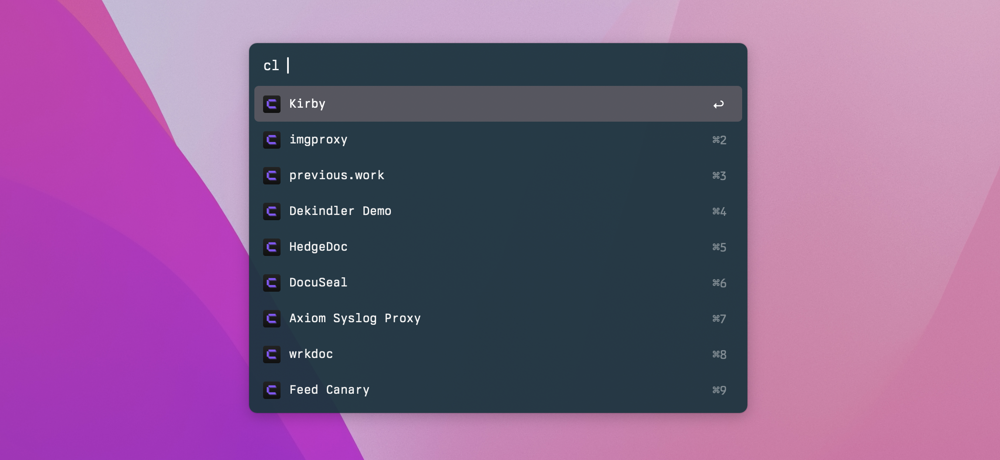

# Coolify Alfred Workflow

An [Alfred](https://www.alfredapp.com) workflow for quickly launching [Coolify](https://coolify.io) servers and projects in a browser.

Screenshot using the dark variant of my [custom theme](https://github.com/mattstein/alfred-theme).

## Installation

Download the `.alfredworkflow` file from the [latest release](https://github.com/mattstein/alfred-coolify-workflow/releases) and double-click to install.

## Configuration

You need to set environment variables to connect with your Coolify instance’s API, and optionally for the cache duration.

You can set these from the **Workflows** settings, clicking **Coolify Shortcuts**, then the **[x]** at the top right, and clicking the **Environment Variables** tab.

| Variable | Default | Required? | Note |
| --- | --- | --- | --- |
| `COOLIFY_FQDN` | `app.coolify.io` | ✅ | Must be the domain name of your instance if you self-host. |
| `COOLIFY_API_TOKEN` | | ✅ | Read-only token created in **Keys & Tokens** → **API tokens**. |
| `CACHE_SECONDS` | 30 | ❌ | Duration for which cached responses will be re-used. |

## Usage

Use the Alfred trigger `cl` to automatically list all servers and projects, which can optionally be filtered if you keep typing. (`cl fuzz`, for example, would limit the result list to projects or servers containing “fuzz”.)

Press <kbd>return</kbd> to open a browser window with that item in Coolify’s control panel.
